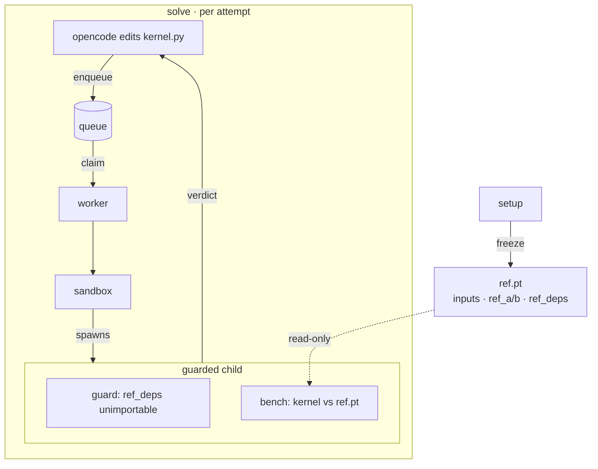

# Isolation

How a kernel is benched without trusting it. Boundary = the reference is **absent** where the kernel runs (frozen tensors + an import guard), not detected after the fact.



`guard` makes `ref_deps` unimportable; `bench` compares against `ref.pt` and never builds the reference. Per attempt = one queue job.

## `src/worker/`

| file | role |
|---|---|
| `contract.py` | the one pure seam: `run_job(config) -> verdict`. |
| `queue.py` + `queue_schema.sql` | durable SQLite queue; lease expiry reclaims a crashed worker's job. |
| `pool.py` | one persistent worker per GPU (CUDA booted once). |
| `guard.py` | `sys.meta_path` finder; blocks `import`/`importlib`/`__import__` of `ref_deps`. |
| `sandbox.py` | guarded child: `AK_SANDBOX=subprocess` (any OS) \| `bwrap` (Linux, defense-in-depth). |

```
python3 src/cli.py pool --gpus 0,1 --queue configs/queue.db
AK_QUEUE=configs/queue.db python3 src/cli.py solve --config …
```
